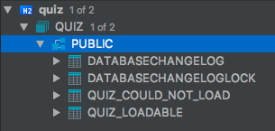

Tech Quiz
=========

Liquibase
---------

Liquibase 是一个数据库的版本管理工具，它当前并不支持从 jar 包中读取 changelog 并执行。

> 可在 [liquibase](https://github.com/propersoft-cn/propersoft-cn.github.io/tree/master/recruit/tech-quiz/liquibase) 路径下执行 `./gradlew bootRun`，执行结束后，查看 h2 数据库中内容，可以看到如下图所示的表


而我们的项目通常都采用按模块分割成不同 jar 包的方式对外提供服务，也希望每个模块的数据库初始化语句内聚在各自的模块中。

> 例如 [changelog-in-jar.jar](./liquibase/libs/changelog-in-jar.jar) (https://github.com/propersoft-cn/propersoft-cn.github.io/blob/master/recruit/tech-quiz/liquibase/libs/changelog-in-jar.jar)

如何不破坏我们对 jar 包的划分方式以及各模块的内聚性，又能够让依赖这些模块的服务能够正常完成数据的初始化工作，以达到如下图所示预期效果？



>  调整过后再次执行 `./gradlew bootRun`，期望在数据库中能够看到 `QUIZ_COULD_NOT_LOAD` 表，且该表是通过 `changelog-in-jar.jar` 中的 `changelog` 创建出来的


Hibernate
---------

在 Spring4 + Hibernate4 的框架下，hibernate 二级缓存的单元测试能够执行通过。

> 可见 [HibernateQueryCacheTests](https://github.com/propersoft-cn/propersoft-cn.github.io/blob/master/recruit/tech-quiz/hibernate/src/test/groovy/com/proper/quiz/hibernate/HibernateQueryCacheTests.groovy) 中的 `checkQueryCache`

但在升级至 Spring5 + Hibernate5 后，单元测试无法通过，请尝试找出原因，并给出解决方案。

> 升级时，可修改 [build.gradle](https://github.com/propersoft-cn/propersoft-cn.github.io/blob/master/recruit/tech-quiz/hibernate/build.gradle) 中的如下内容

```
--- a/hibernate/build.gradle
+++ b/hibernate/build.gradle
@@ -20,17 +20,16 @@ dependencies {
     compile('org.codehaus.groovy:groovy:2.4.15')
     runtime('com.h2database:h2:1.3.176')

-    def spring = '4.3.0.RELEASE'
-    def springData = '1.11.10.RELEASE'
-    def hibernate = '4.3.10.Final'
+    def spring = '5.0.7.RELEASE'
+    def springData = '2.0.8.RELEASE'
+    def hibernate = '5.2.17.Final'

     compile "org.springframework:spring-context-support:${spring}"
     compile "org.springframework:spring-webmvc:${spring}"
     compile "org.springframework.data:spring-data-jpa:${springData}"
     compile "org.hibernate:hibernate-ehcache:${hibernate}"
-    compile "org.hibernate:hibernate-entitymanager:${hibernate}"
-    compile 'net.sf.ehcache:ehcache-core:2.6.9'
-    compile 'javax.servlet:javax.servlet-api:3.0.1'
+    compile 'net.sf.ehcache:ehcache:2.10.5'
+    compile 'javax.servlet:javax.servlet-api:3.1.0'
     compile "ch.qos.logback:logback-classic:1.2.3"
     compile "ch.qos.logback:logback-core:1.2.3"
```
